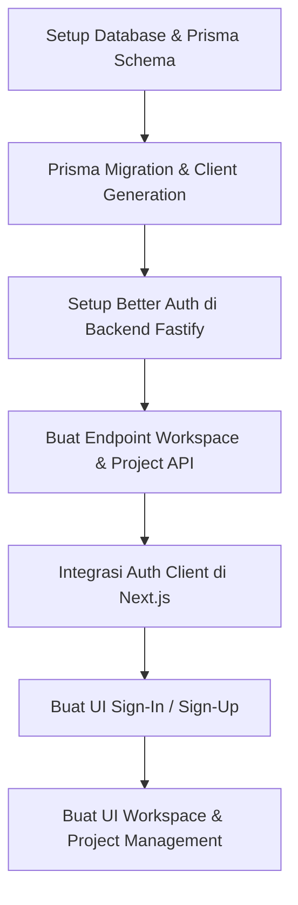

# Rencana Implementasi MVP (v0.1) - Developer Workspace

Rencana ini memetakan langkah-langkah konkret untuk membangun versi **v0.1** dari sistem Developer Workspace berdasarkan visi dan target yang telah didefinisikan.

---

## 1. Desain Database & Skema Prisma (`packages/database`)
Langkah awal adalah mendesain relasi data di `schema.prisma`. Untuk v0.1, kita membutuhkan tabel-tabel berikut:

### Kebutuhan Autentikasi (Better Auth)
* **`User`**: Menyimpan data user (id, name, email, image, dll.).
* **`Account`**: Informasi akun OAuth / Kredensial.
* **`Session`**: Sesi aktif pengguna.
* **`Verification`**: Token verifikasi (untuk email/password reset jika diperlukan).

### Kebutuhan Workspace & Project
* **`Workspace`**: Wadah utama organisasi (id, name, slug, ownerId, createdAt).
* **`WorkspaceMember`**: Relasi user yang masuk ke workspace beserta perannya (Owner, Admin, Member).
* **`Project`**: Proyek di dalam workspace (id, name, description, workspaceId, githubRepoUrl, createdAt).

---

## 2. Implementasi Backend (`apps/api`)
Backend menggunakan Fastify dan harus memvalidasi data menggunakan Zod.

### A. Autentikasi (Better Auth)
* Integrasikan Better Auth dengan Prisma Adapter di backend.
* Buat route handler `/api/auth/*` di Fastify untuk memproses request autentikasi.

### B. REST API Endpoint
Semua endpoint berikut dilindungi oleh middleware auth session:
* **Workspace API**:
  * `POST /workspaces` (Buat workspace baru)
  * `GET /workspaces` (Daftar workspace user)
  * `GET /workspaces/:id` (Detail workspace beserta project di dalamnya)
  * `POST /workspaces/:id/members` (Undang/tambah anggota)
* **Project API**:
  * `POST /workspaces/:workspaceId/projects` (Buat project di workspace tertentu)
  * `GET /projects/:id` (Detail project & dashboard info)

---

## 3. Implementasi Frontend (`apps/web`)
Frontend menggunakan Next.js (App Router), Tailwind CSS, dan shadcn/ui.

### A. Setup Better Auth Client & Route Protection
* Setup client-side Better Auth SDK.
* Buat middleware Next.js untuk memproteksi halaman agar hanya bisa diakses user yang sudah login.

### B. Halaman Autentikasi (Auth Pages)
* Halaman Register / Sign Up.
* Halaman Login / Sign In (dengan email/password dan opsi GitHub OAuth).

### C. Halaman Utama & Workspace Management
* **Workspace Selector**: Halaman awal setelah login untuk memilih atau membuat workspace baru.
* **Workspace Dashboard**: Menampilkan daftar proyek yang ada di dalam workspace yang sedang aktif beserta anggotanya.

### D. Project Dashboard
* Halaman detail project v0.1 yang menampilkan ringkasan data proyek.

---

## 4. Alur Kerja & Langkah Pengerjaan

### Milestone & Target
1. **Langkah 1**: Update `schema.prisma` -> Generate Client -> Run Migration.
2. **Langkah 2**: Setup Fastify server & integrasi Better Auth.
3. **Langkah 3**: Buat route API Workspace & Project.
4. **Langkah 4**: Desain UI Next.js untuk Auth & Workspace.
